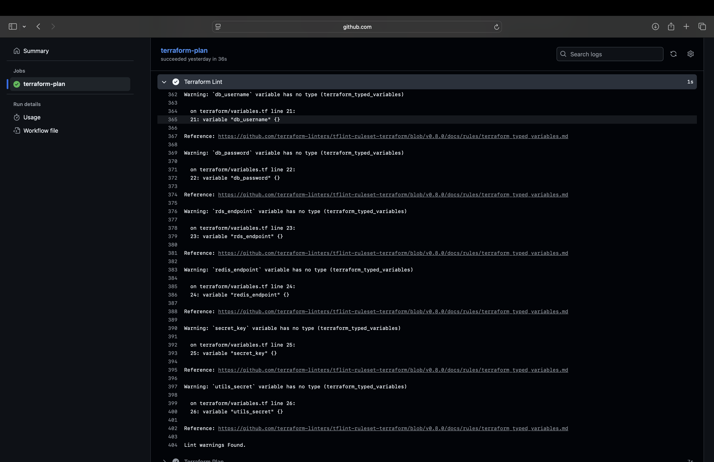
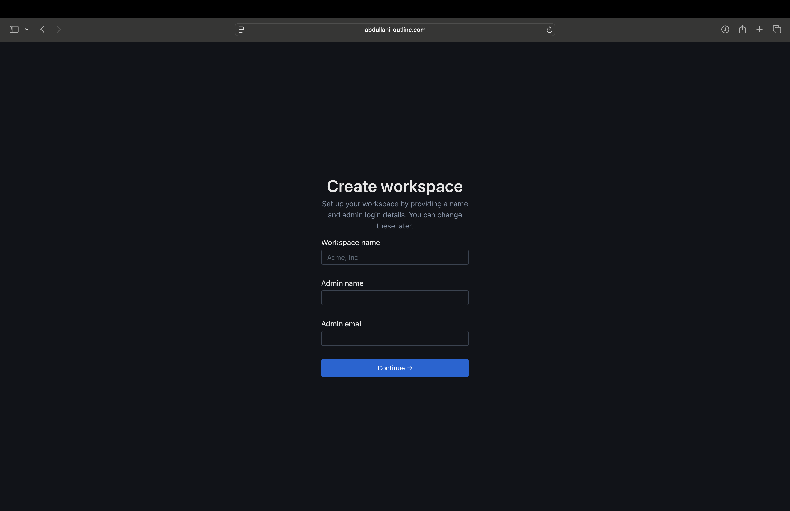

# Outline App – Document Collaboration Platform

The **Outline App** in this repository is a **self-hosted knowledge base and document collaboration platform**.  
It allows teams to create, share, and edit documents in real time leveraging **PostgreSQL** for persistence and **Redis** for queues and live collaboration.

This project showcases a **complete end-to-end AWS deployment**, built using:

- **Terraform** for Infrastructure as Code  
- **Docker** for containerization  
- **AWS ECS Fargate** for serverless container orchestration  
- **Application Load Balancer (ALB)** for secure HTTPS routing and traffic distribution  
- **Auto Scaling** for high availability and adaptive resource scaling  
- **GitHub Actions** for CI/CD automation  
- **Cloudflare** for DNS and HTTPS management via **AWS ACM**

---

## Features

- Real-time document collaboration  
- Containerized & orchestrated - built with a multi-stage Dockerfile, deployed on ECS Fargate behind an ALB.
- Cloud deployment - secured ECS Fargate setup with least-privilege IAM roles. 
- Infrastructure automated with Terraform  
- Secrets and configuration managed with AWS Systems Manager Parameter Store  
- Continuous integration and delivery with GitHub Actions  
- HTTPS and DNS managed through **Cloudflare**

## 🗂️ Project Structure

```bash
Outline-App/
│
├── .github/
│   └── workflows/
│       ├── build.yml                 # Builds and pushes Docker image to ECR
│       ├── terraform-plan.yml        # Runs terraform fmt, validate, and plan
│       ├── terraform-apply.yml       # Manually triggered apply workflow
│       └── terraform-destroy.yml     # Manual destroy workflow with confirmation
│
├── terraform/
│   ├── modules/
│   │   ├── acm/                      # SSL certificate management via AWS ACM
│   │   ├── alb/                      # Application Load Balancer setup
│   │   ├── ecs_service/              # ECS cluster, service, and task definitions
│   │   ├── elasticache/              # Redis cluster configuration
│   │   ├── iam/                      # IAM roles and execution policies
│   │   ├── rds/                      # PostgreSQL RDS setup
│   │   ├── security_groups/          # Security group rules for ECS, RDS, Redis, ALB
│   │   └── vpc/                      # Custom VPC, subnets, IGW, NAT gateways
│   │
│   ├── main.tf                       # Root Terraform configuration
│   ├── provider.tf                   # AWS provider configuration
│   ├── ssm.tf                        # SSM parameters for app secrets
│   ├── variables.tf                  # Input variable definitions
│   ├── terraform.tfvars              # Downloaded securely from S3 and only stored locally
│   └── outputs.tf                    # Outputs for ECS, ALB, and other components
│
├── docker-compose.yml                # Local development setup
├── Dockerfile                        # Container build file
└── README.md
```

## 🏗️ Architecture Overview

This diagram shows how all AWS components and services fit together:


### Components

- **Cloudflare DNS** – Manages public domain and CNAME records for the Application Load Balancer.
- **ALB (Application Load Balancer)** – Terminates HTTPS, performs health checks, and routes traffic to ECS tasks.
- **ECS Fargate Service** – Runs the containerized Outline app within private subnets.
- **Auto Scaling** – Automatically adjusts ECS task count based on CPU and memory usage.
- **RDS PostgreSQL** – Stores documents and metadata persistently.
- **ElastiCache Redis** – Provides in-memory caching and supports real-time collaboration.
- **SSM Parameter Store** – Securely stores application secrets and configuration values.
- **S3 + DynamoDB** – Used as the remote backend for Terraform state management.
- **NAT Gateway** – Enables ECS tasks to access the internet for updates while remaining in private subnets.
- **ACM (AWS Certificate Manager)** – Issues HTTPS certificates, validated via Cloudflare DNS.

---

## SSL & DNS

- **Domain & DNS:** The domain is managed by **Cloudflare**. A CNAME record points the root (`@`) to the ALB’s DNS name.  

- **SSL/TLS:** Certificates are issued via **AWS ACM** and validated through Cloudflare using CNAME records.

- **HTTPS:** All traffic terminates on the ALB using the ACM certificate.


---

## Deployment & CI/CD

Deployment is fully automated using **GitHub Actions**:

1. **Build & Push** - On push to `main`, GitHub Actions builds the Docker image and pushes it to **Amazon ECR**.  
2. **Terraform Plan** - Another workflow runs `terraform plan` to preview and validate infrastructure changes automatically on push or PR.  
3. **Terraform Apply** - Manually triggered with a confirmation input to prevent accidental infrastructure updates; safely deploys approved changes to AWS.  
4. **Terraform Destroy** - Also manually triggered with a confirmation input to avoid unintended deletions; cleanly tears down AWS resources when needed.

See `.github/workflows/` in this repo for the YAML configuration.

### Screenshots

| Workflow | Screenshot | Description |
|-----------|-------------|-------------|
| Build & Push |  | Successful Docker image build and push to ECR. |
| Terraform Plan |  | Terraform plan output. |
| Terraform Lint |  | Terraform plan lint successfully passing with warnings ignored. |
| Terraform Apply |  | Terraform apply output. |
| Terraform Destroy |  | Terraform destroy output. |

---

# Screenshots

The following screenshots highlight the key components and verification points of the Outline App deployment - from infrastructure provisioning to application validation.


*ECS service running one healthy Fargate task behind the Application Load Balancer.*
 
*ECS service running one healthy Fargate task behind the Application Load Balancer.*

*ECS auto scaling policy dynamically adjusts the number of running tasks based on CPU utilisation.*

*PostgreSQL RDS instance provisioned in private subnets, storing application data.* 

*Redis ElastiCache cluster configured for caching and real-time document collaboration.*

*AWS Systems Manager Parameter Store securely managing sensitive application secrets.*

*S3 backend showing Terraform state file used during backend initialisation.*

*Outline App home page running securely over HTTPS*

*Real-time collaborative editor interface inside the Outline App.*

*CloudWatch logs confirming the application container started successfully and is serving requests.*

---

## 🧑‍💻 Local Development Setup

You can run the **Outline App** locally using **Docker Compose**, which spins up PostgreSQL, Redis, and the Outline web app — replicating the AWS environment locally.

---

### **Prerequisites**
- [Docker Desktop](https://www.docker.com/products/docker-desktop/) installed  
- A valid `.env` file in the project root directory  
  *(see `.env.example` for guidance - never commit your real `.env` to GitHub)*

---

### **1️⃣ Clone the Repository**
```bash
git clone https://github.com/abdullahiabdullahi1002-cloud/Outline-App.git
cd Outline-App
```

### **2️⃣ Create a `.env` File**

Copy `.env.sample` to `.env`.

This is what the app reads for things like ports, URLs, database, Redis, etc. For local dev most of the defaults in the sample will work out of the box, you just need the file there so Docker can load it.


### **3️⃣ Run the Application**

To build and start the containers:
```bash
docker-compose up --build
```

### **4️⃣ Stop the Application**

To stop the containers:
```bash
docker-compose down

```

---
# About This Project

This project shows a production-style deployment of the Outline app on AWS. It uses Terraform to provision the infrastructure (VPC, ECS Fargate, ALB with HTTPS, RDS PostgreSQL, Redis, AWS Systems Manager, etc.) and GitHub Actions to build/push the Docker image to ECR and apply changes. The goal is to demonstrate end-to-end cloud delivery, not just running the app locally.
